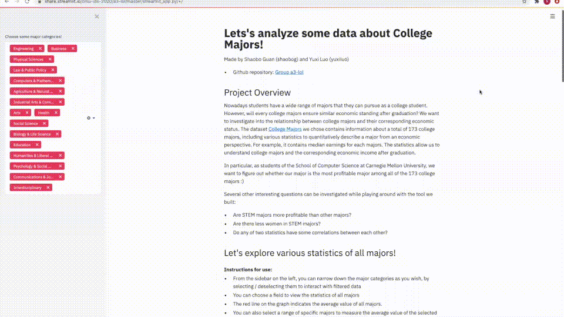
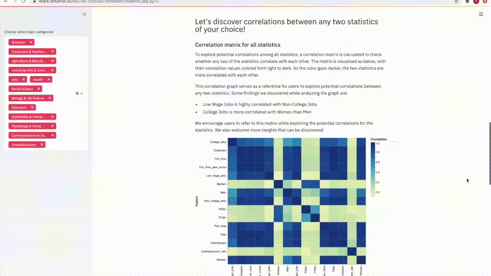
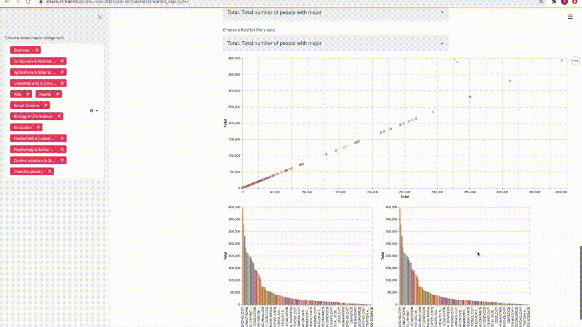
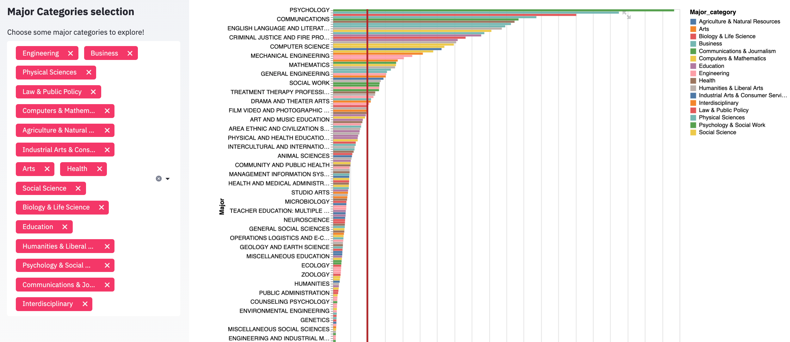

# College Majors Exploration - Group a3-lol

## Project Goals

Nowadays students have a wide range of majors that they can pursue as a college student. However, will every college majors ensure similar economic standing after graduation? We want to investigate into the relationship between college majors and their corresponding economic status. The dataset [College Majors](https://github.com/fivethirtyeight/data/blob/master/college-majors/recent-grads.csv) we chose contains information about a total of 173 college majors, including various statistics to quantitatively describe a major from an economic perspective. For example, it contains median earnings for each majors. The statistics allow us to understand college majors and the corresponding economic income after graduation.

The main goal of our project is to enable users to find useful information about jobs and majors. Our main target users are those who start their college and need some job-related information to help them pick a major, or those who will graduate recently and try to find how competent is his/her major in the job market. Moreover, this project is also designed for researchers who want to investigate social issues in terms of jobs, gender and majors (e.g., Does median wages correlate to women share of a specific major?).

In particular, as students of the School of Computer Science at Carnegie Mellon University, we want to figure out whether our major is the most profitable major among all of the 173 college majors.

Several other interesting questions can be investigated while playing around with the tool we built:

- Are STEM majors more profitable than other majors?
- Are there less women in STEM majors?
- Do any of two statistics have some correlations between each other?

## Design

### Major Categories sidebar

Firstly, our project provides a multi-select box to enable users to pick major categories they want to focus on investigating: for example, Engineering, Law, and Mathematics, etc. The reason for this filter functionality is that instead of all majors, users probably tend to know information about some specific ones. In this way, users can filter out the undesired majors from the visualization to better focus on the selected ones.

We considered other alternatives to achieve this functionality. For example, we could introduce another dropdown menu for every visualizations to allow users to select the major categories, but this kind of solution introduces redundant buttons for users to select, which worsens the experience of using our visualization.

### Statistics on all majors

The first visualization demonstrates aggregated data with respect to majors and a user-controlled field (e.g., Median Wage). We also insert a red line which represents the average value of the selected field, enabling users to compare their target data with the mean of the selected field. Combining these visual encodings together could allow users to find answers about some complicated questions they raise: for example, “What’s the difference between the expected wage of my major and the average wages of the top 25% highest-wages majors?”.

We thought about using scatter plots to visualize this data, but found that they are deficient to visually reflect different quantities, so we choose bar charts instead to help displaying this kind of information.

### Correlation exploration on statistics

The second visualization is used for revealing statistical relationships between fields, which is served more as a tool than a conclusion drawn by the visualization makers.

To explore potential correlations among all statistics, a correlation matrix is calculated to check whether any two of the statistics correlate with each other. The matrix is visualized with their correlation values colored from light to dark. As the color goes darker, the two statistics are more correlated with each other.

The correlation matrix serves as a reference for users to discover potential correlations between any of the two statistics, based on the displayed correlation values. It would be also interesting to look at the statistics under specific major category. Some findings we discovered while analyzing the graph are listed below. However, we encourage users to explore and discover more insights about the statistics.
  - Low Wage Jobs is highly correlated with Non-College Jobs
  - College Jobs is more correlated with Women than Men

We considered other method to display this correlation matrix. For example, we can plot the visualizations with scatter plot. However, without the color encoding like the heatmap presented above, it is hard to visually understand what are the more correlated statistics.

Three sub-visualizations build up the whole picture: the upper scatter plot reveals the distribution with respect to two fields, and the rest two bar charts shows the values of each field with respect to majors. Users can use the scatter plot to investigate the relationship between the selected two fields, and to examine whether there is any correlation between the two fields. Users can also select a range of majors to further examine their corresponding data in the lower two bar charts. The two bar charts are not just redundant iterations of the data represented by the scatter plot. They are actually useful because:
-  it vividly shows the exact data with a user-defined region, in which points could be potentially close to each other and hard to perceive the exact value
-  it helps distinguish the major categories of a selected region, as the area of a bar is much larger than a point

We discussed other possibilities to display this kind of data. For example, grouped bar charts are also considered, but we then realized that they do not serve as a good visualization for correlation discoveries.

## Development

In total, 15 + 5 + 30 = 50 hours are spent to finish the entire visualization process. Both teammates contributed a lot to the project, by splitting up the jobs evenly and iteratively review each other's work. Below are the breakdown of our development process:

1. Data selection and Exploratory Data Analysis: Both teammates investigated into several data sources and discuss potential visualizations for each datasets. A documentation was created to keep track of though processes along the way, including possible data sources to be used (for example, [World Bank data](https://data.worldbank.org/indicator), [Flight delay data](https://www.kaggle.com/usdot/flight-delays?select=flights.csv), and [College major data](https://github.com/fivethirtyeight/data/tree/master/college-majors)). We discussed potential visualizations for each sources, and then decided the final source dataset among the possible datasets. In total, the exploratory data analysis process took 15 hours.

2. Data understanding: After choosing the target dataset [College major data](https://github.com/fivethirtyeight/data/tree/master/college-majors), both teammates spent time on analyzing the nature of the data and figure out what are some interesting questions to be discovered by this kind of dataset. In total, it took 5 hours for us to determine what kind of visualization suit best for this dataset, and what are the valuable part should be presented to the users.

3. Implementation: Data fetching, filtering, and displaying are performed with Streamlit. Shaobo (shaobog) focused on creating and utilizing bar charts and scatter plots to visualize and display the dataset correspondingly. Yuxi (yuxiluo) focused on providing major category selection, creating correlation matrix, fine-tuning the final version of the website, and finalizing the narratives of the visualizations. Both of the teammates spent time to evaluate the current process and determine the next steps to improve current visualizations. In total, it took 30 hours for us to finalize the entire visualization.

The Implementation took the most time, because for each visualization we iteratively provided ideas to improve the visualizations. For each specific functionality, there were many bugs we spent time to work on so that the final implementation is bug-free and well-structured.
